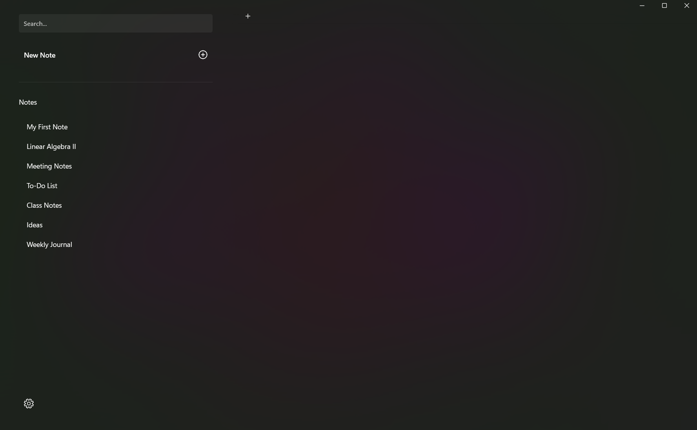
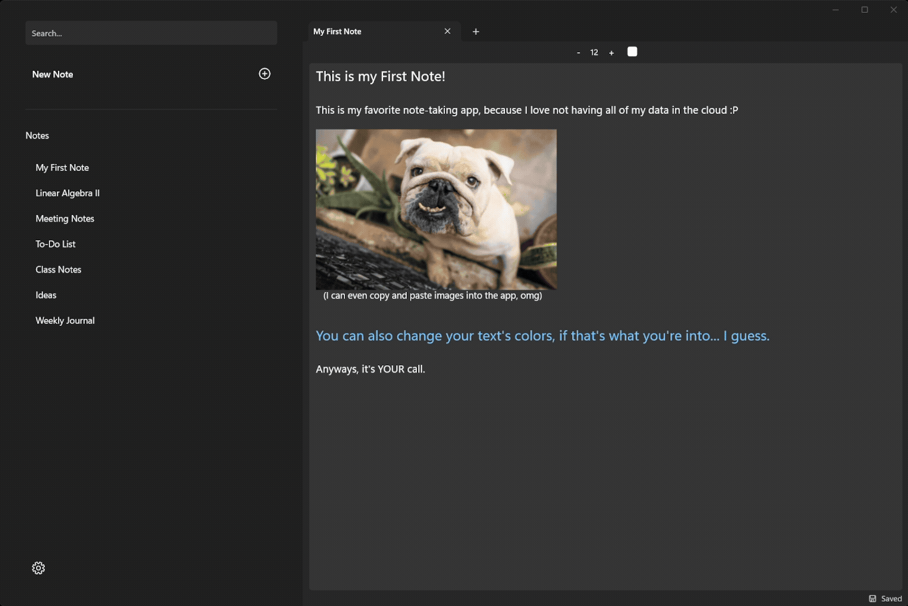

<h1 align="center">UrNotes</h1>

<p align="center">
  <strong>A native Windows note-taking app — write, format, and forget about saving.</strong>
</p>

<p align="center">
  
  
  
</p>

<p align="center">
UrNotes is an elegant desktop note-taking application built on WinUI 3, designed to be "as quick as Paint" on Windows 11.
</p>



<p align="center">
  <em>Local-first rich text notes with image support, instant search, and automatic saving.</em>
</p>

## Built With

| Layer        | Technology                                                        |
| ------------ | ----------------------------------------------------------------- |
| UI Framework | [WinUI 3](https://learn.microsoft.com/windows/apps/winui/winui3/) |
| Language     | C# 12 on .NET 8                                                   |
| Architecture | MVVM (Views / ViewModels / Models)                                |
| Text Format  | Rich Text Files (.rtf)                                            |
| Persistence  | JSON store                                                        |
| Testing      | _none as of yet_                                                  |

## Features



- **Rich text:** full RTF formatting through the native editor.
- **Hands-off saving:** edits auto-save after a short pause in typing; a status bar under the editor shows `Auto-Saving...` / `Saved`, plus a manual save button if you're getting impatient.
- **Instant search:** the search bar, on the left panel, helps find your notes by name as you type.
- **Note management:** CRUD of notes from the left panel.
- **Local-first:** everything lives in a single json file on your machine.

## Running the Project

Requirements:

- Visual Studio 2022 (17.10+) with the **Windows application development** workload
- Windows 11

1. Open `UrNotes.sln` in Visual Studio.
2. Pick a platform (`x64`, `x86`, `ARM64`)
3. Run **UrNotes**

Notes are stored next to the app binaries under `data/notes/data.json`.

## Solution Layout

<details>
<summary><strong>Expand the project tree</strong></summary>

<br>

```
UrNotes/
├── Models/                 #Domain classes
│   ├── Note.cs             #Note entity
│   └── DTOs/
│       └── NoteDTO.cs      #Serialization shape for JSON storage
├── Services/
│   └── NotesDataManager.cs #Writes & Reads the JSON data store
├── ViewModels/
│   └── NotesViewModel.cs   #Operations related to Notes
├── Views/
│   ├── MainView.xaml       #Tab host + editor composition
│   └── UserControls/
│       ├── Buttons/
│       ├── Inputs/         #Controls requiring user text input
│       └── General/        #Menus, Panels, Groups
├── App.xaml
└── MainWindow.xaml         #Window shell hosting MainView
```

</details>

---

<p align="center">
  <sub><strong>Raúl Villarreal</strong> · 2026</sub>
</p>
